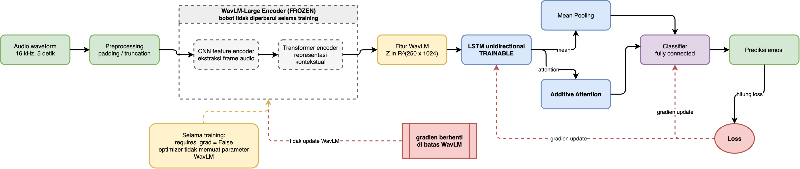
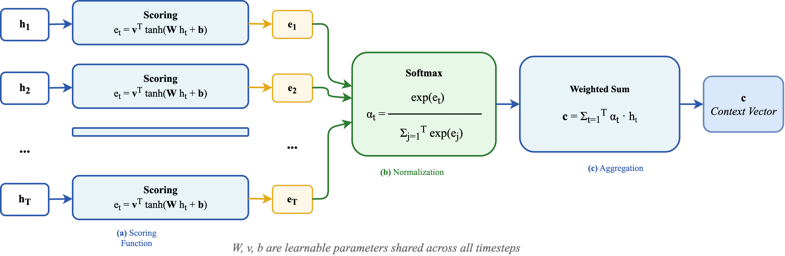

# WavLM + LSTM for Speech Emotion Recognition

[](LICENSE)

**Additive Attention Mechanism in LSTM Architecture for Speech Emotion Recognition with Frozen WavLM-Large: A Multi-Dataset Evaluation**

Evaluasi kontribusi mekanisme *additive attention* terhadap performa LSTM untuk *Speech Emotion Recognition* (SER) berbasis fitur *frozen* WavLM-Large, divalidasi pada 6 dataset lintas bahasa (Inggris, Jerman, Italia).

---

## Arsitektur Model

### Pipeline Keseluruhan



### Mekanisme Additive Attention



Additive attention (Bahdanau 2015) bekerja dalam tiga tahap:
1. **(a) Scoring**: Skor energi `e_t = v^T tanh(W h_t + b)` dihitung untuk setiap hidden state LSTM
2. **(b) Normalization**: `α_t = softmax(e_t)` menghasilkan bobot atensi yang berjumlah 1
3. **(c) Aggregation**: Context vector `c = Σ α_t · h_t` sebagai representasi tertimbang seluruh timestep

Parameter **W**, **v**, dan **b** dipelajari selama training dan digunakan bersama (*shared*) untuk seluruh timestep.

Dua model dievaluasi dalam eksperimen ini:

| Model             | Temporal Pooling          | Deskripsi                                       |
| ----------------- | ------------------------- | ----------------------------------------------- |
| **LSTM + Mean**   | Masked Mean Pooling       | Rata-rata terbobot dari hidden state LSTM       |
| **LSTM + Attention** | Additive Attention     | Bobot atensi adaptif per timestep (Bahdanau 2015) |

Kedua model menggunakan **WavLM-Large** sebagai encoder yang dibekukan (*frozen*). Perbedaan **hanya** pada mekanisme agregasi temporal — semua komponen lain (LSTM, classifier MLP, hyperparameter) identik.

---

## Dataset

6 dataset lintas bahasa digunakan untuk validasi:

| Dataset   | Bahasa   | Speaker | Kelas | Referensi                                            |
| --------- | -------- | ------- | ----- | ---------------------------------------------------- |
| RAVDESS   | English  | 24      | 7     | [Livingstone & Russo (2018)](https://doi.org/10.1371/journal.pone.0196391) |
| EmoDB     | German   | 10      | 6     | [Burkhardt et al. (2005)](http://emodb.bilderbar.info/) |
| SAVEE     | English  | 4       | 7     | [Jackson & Haq (2014)](https://www.kaggle.com/datasets/ejlok1/surrey-audiovisual-expressed-emotion-savee) |
| TESS      | English  | 2       | 7     | [Dupuis & Pichora-Fuller (2018)](https://www.kaggle.com/datasets/ejlok1/toronto-emotional-speech-set-tess) |
| CREMA-D   | English  | 91      | 6     | [Cao et al. (2014)](https://github.com/CheyneyComputerScience/CREMA-D) |
| EMOVO     | Italian  | 6       | 7     | [Costantini et al. (2014)](https://zenodo.org/record/3464334) |

---

## Hasil

| Dataset   | LSTM + Mean (Acc / F1) | LSTM + Attention (Acc / F1) |
| --------- | ---------------------- | --------------------------- |
| RAVDESS   | 92.01% / 0.9206        | 92.71% / 0.9268             |
| EmoDB     | 93.91% / 0.9358        | 96.09% / 0.9588             |
| SAVEE     | 83.33% / 0.8400        | 88.10% / 0.8788             |
| TESS      | 98.93% / 0.9893        | 99.64% / 0.9964             |
| CREMA-D   | 92.48% / 0.9244        | 92.92% / 0.9290             |
| EMOVO     | 86.57% / 0.8649        | 87.31% / 0.8731             |

Detail lengkap, confusion matrix, dan per-class metrics tersedia di folder `results/`.

---

## Menjalankan Eksperimen

### Prasyarat

- Python 3.10+
- PyTorch 2.5+
- CUDA (opsional, untuk GPU)

```bash
pip install torch torchaudio transformers scikit-learn matplotlib seaborn pandas tqdm
```

### Download Dataset

Lihat [datasets/README.md](datasets/README.md) untuk petunjuk download dan struktur folder.

Untuk TESS, bangun waveform cache terlebih dahulu (opsional, mempercepat loading):

```bash
python experiments/cache_waveforms.py --dataset tess
```

### Training

```bash
# LSTM + Mean Pooling
make train-mean PRESET=ravdess

# LSTM + Additive Attention
make train-attention PRESET=emodb

# Semua dataset, kedua model
make train-all
```

Atau langsung dengan Python:

```bash
python experiments/train_lstm_mean.py --preset ravdess
python experiments/train_lstm_attention.py --preset emodb
```

Preset yang tersedia: `ravdess`, `ravdess_no_calm`, `ravdess_8class`, `emodb`, `savee`, `tess`, `crema_d`, `emovo`.

### Output

Setiap run menghasilkan di `results/{mean,attention}/{dataset}/`:

- `best_model.pth` — Model checkpoint terbaik
- `results.json` — Ringkasan metrik
- `history.csv` — Log per epoch
- `training_curves.png` — Plot loss & akurasi
- `confusion_matrix.png` / `.csv` / `.txt` — Confusion matrix
- `per_class_metrics.csv` / `per_class_report.txt` — Precision/recall/F1 per kelas

---

## Referensi Utama

| Paper | Deskripsi |
| ----- | --------- |
| [Bahdanau et al. (2015)](https://arxiv.org/abs/1409.0473) | *Neural Machine Translation by Jointly Learning to Align and Translate* — Paper fundamental yang memperkenalkan **additive attention** (Bahdanau attention). |
| [Chen et al. (2022)](https://arxiv.org/abs/2110.13900) | *WavLM: Large-Scale Self-Supervised Pre-Training for Full Stack Speech Processing* — Encoder pra-latih WavLM-Large yang digunakan sebagai **feature extractor frozen**. |
| [Mirsamadi et al. (2017)](https://ieeexplore.ieee.org/document/7952152) | *Automatic Speech Emotion Recognition Using Recurrent Neural Networks with Local Attention* — Penerapan awal atensi pada LSTM untuk SER. |

---

## Template Tesis Udinus

Folder `thesis-template/` berisi template LaTeX untuk tesis Universitas Dian Nuswantoro (UDINUS) Semarang. Template ini mengikuti **Lampiran 16 Panduan Tesis Udinus** dengan fitur:

- **Struktur lengkap**: Halaman sampul, judul, pengesahan status, pernyataan, persetujuan, pengesahan, abstrak (EN/ID), daftar publikasi, TOC, daftar tabel/gambar/algoritma, 5 bab, daftar pustaka, lampiran
- **Format sesuai panduan**: Margin 4-3-3-3 cm, spasi 1.5, Times New Roman 12pt, penomoran BAB romawi
- **Dukungan TikZ/PGFPlots**: Gambar teknik dan grafik dalam dokumen
- **Algorithm2e**: Pseudocode terformat
- **natbib + BibTeX**: Sitasi IEEE style
- **Kompilasi**: `cd thesis-template && make` (atau `latexmk -pdf thesis.tex`)

---

## Struktur Repository

```
wavlm-ser/
├── experiments/
│   ├── train_lstm_mean.py         # LSTM + Mean Pooling
│   ├── train_lstm_attention.py    # LSTM + Additive Attention
│   ├── utils.py                   # Dataset loading, training loop, utilities
│   └── presets.json               # Hyperparameter per dataset
├── datasets/                      # Dataset (download sendiri)
│   ├── ravdess/
│   ├── emodb/
│   ├── savee/
│   ├── tess/
│   ├── crema_d/
│   └── emovo/
├── results/
│   ├── mean/                      # Output LSTM + Mean
│   └── attention/                 # Output LSTM + Attention
├── docs/
│   ├── wavlm-frozen-architecture.drawio
│   └── wavlm-frozen-architecture.png
├── thesis-template/               # Template LaTeX Tesis Udinus
├── Makefile
└── README.md
```

---

## Lisensi

MIT License.
